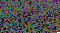

Name
====

`bin2bmp` -- Convert binary files to bitmaps for visual inspection

Synopsis
========

	bin2bmp <-i INPUT-FILE> [-w WIDTH] [-o OUTPUT-FILE] [-d DEPTH]
		[-v] [-r] [-t] [-T]

Description
===========

This script converts arbitrary files to bitmap images by encoding the binary
data in the pixel values. This can be used for visual inspection of small and
medium-sized (up to a few megabytes) files. Additionally, it is possible to
reverse the encoding by means of the `-r` option.

Technically, larger files will work, too. Although there does not seem to be
a good usecase for it, check section _Issues with Large Files_ if interested.

Options
=======

----  -----------  -------------------------------------------------
`-i`  INPUT-FILE   Input filename (required)
`-w`  WIDTH        Width of output image (default is 1200)
`-o`  OUTPUT-FILE  Output filename (default is `input_filename.png`)
`-d`  DEPTH        Set color depth (24 default, 32 also possible)
`-v`               Display version and license information
`-r`               Restore input file a to binary file
`-t`               Write TGA instead of PNG images
`-T`               Write TIFF instead of PNG images
----  -----------  -------------------------------------------------

Examples
========

## Display the source code as image

	./bin2bmp -i bin2bmp -w 60 -o bin2bmp.png

Bugs
====

## Issues with Large Files

 * The whole input and output file is loaded into memory.
   Processing thus requires about two times the size of the input file of
   memory + overhead (for instance: 4 GiB input file needs 10 GiB RAM).
 * The program is entirely single-threaded (hence slow)
 * Large files may exceed the formats' capabilities. Use option `-T` to produce
   TIFF files which can accomodate for large bitmaps. In case other programs
   reject opening the files, consider using a GIS (despite that not being
   its original function, it works well as a viewer for extra-large TIFF files).
 * A better workaround for performance issues is to use `split` to make multiple
   small input files from a single file and then process these files with
   `bin2bmp` in parallel.

## Other

 * Monochrome mode does not work

See Also
========

 * An older version of the bin2bmp source code is available on Pastebin:
   <https://pastebin.com/8W1jA1r9>
 * [BinVis](https://binvis.io)
   ([Source](https://github.com/cortesi/scurve/blob/master/binvis))
